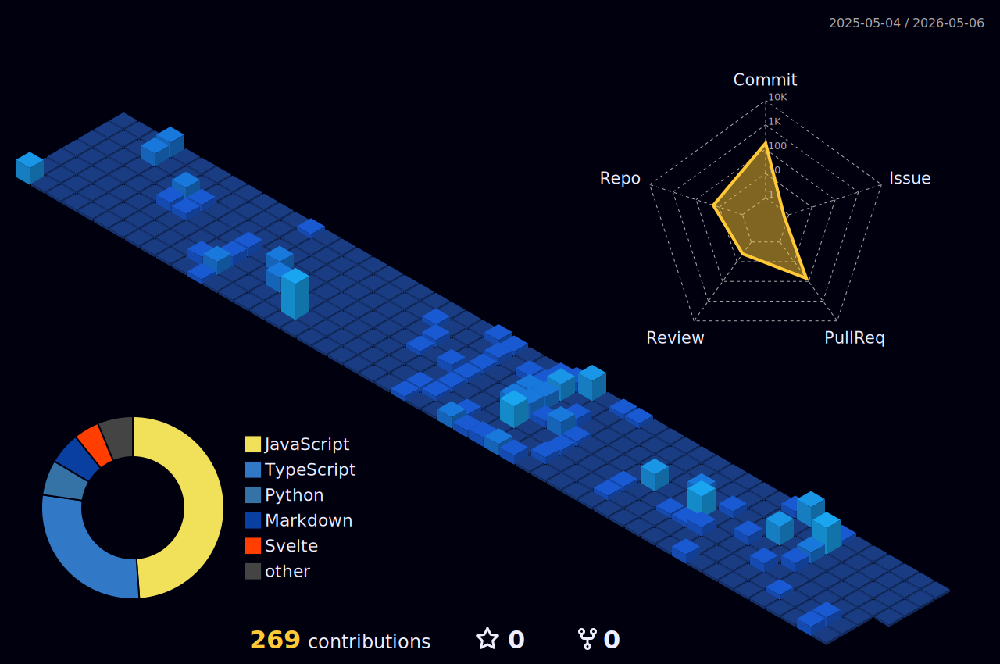

## 👋 Heyy, I'm Ahamed Meyan

**Full-stack Engineer** with a bias toward  
**backend engineering**, building clean and scalable architectures.

I build and maintain backend services, enhance project architecture, and contribute to open-source projects.

---

## GitHub Activity Overview

---

## Open Source Contributions

 

I've contributed to multiple open-source projects, including:

**Mathesar • Hugo • Material UI • Portainer • Docspect • tldr-pages**

---

## Tech Stack

<!-- Row 1 — Languages & Runtimes -->

  

<!-- Row 2 — Frameworks & Frontend Ecosystem -->

  

<!-- Row 3 — Databases & DevOps -->

  

---

## Contact

